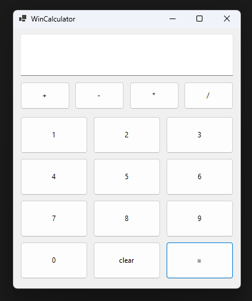

# WinCalculator



WinCalculator is a simple calculator app developed using Windows Forms (WinForms) in C#.

## Features

- **Simple User Interface**: The calculator allows users to perform mathematical calculations by simply clicking the buttons.
- **Supported Operations**: Addition, Subtraction, Multiplication, and Division.
- **Clear Function**: Resets the current input and calculations.

## Features

- Users can input numbers and perform mathematical operations.
- There is a `clear` button to reset the input and calculations.
- The `=` button calculates the result of the current operation.

## Acknowledgements
This project was created as an exercise to practice WinForms development. It was developed with the support of AI assistance, which helped guide and improve the implementation of various features and the structure of the code.

## How to Run the Project

1. Clone this repository to your local machine:
   
   ```bash
   git clone https://github.com/venu21-dev/WinCalculator.git
